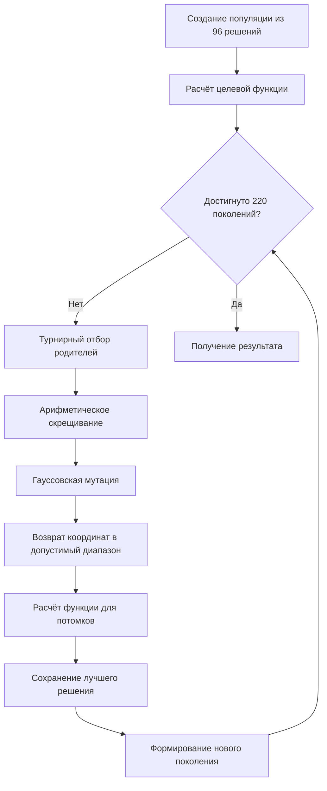
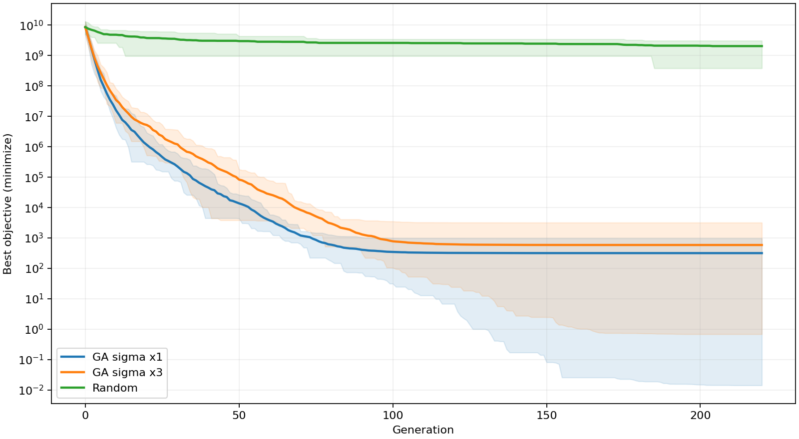

# Лабораторная работа № 1

## Многомерная оптимизация сложной функции генетическим алгоритмом

**Дисциплина:** «Эволюционное программирование и генетические
алгоритмы»  
**Группа:** 507  
**Номер студента:** 17  
**Год:** 2026  
**Вариант:** 16

------------------------------------------------------------------------

## 1. Постановка задачи и индивидуальный вариант

Цель лабораторной работы — реализовать генетический алгоритм для поиска
приближённого глобального минимума многомерной функции и исследовать
влияние параметров алгоритма на качество решения.

Для индивидуального варианта используется функция **«изогнутая сигара»
(Bent Cigar)**.

Размерность задачи:

\[ d = 5 + (16 ) = 9. \]

Требуется найти такие значения девяти переменных, при которых целевая
функция принимает как можно меньшее значение.

------------------------------------------------------------------------

## 2. Пространство решений, целевая функция и ограничения

Каждая координата решения ограничена:

\[ x_i , i=1,,9. \]

Поэтому пространство поиска:

\[ D=\[-100,100\]^9. \]

Целевая функция:

\[ f(x)=x_1<sup>2+10</sup>6\_{i=2}<sup>{9}x_i</sup>2. \]

Задача:

\[ \_{xD} f(x). \]

Теоретический глобальный минимум:

\[ x^*=(0,0,,0), f(x^*)=0. \]

Нулевое решение не добавляется в начальную популяцию: алгоритм должен
самостоятельно приблизиться к минимуму.

Функция гладкая, выпуклая и имеет один глобальный минимум. Её сложность
связана не с большим количеством локальных минимумов, а с тем, что
первая координата имеет коэффициент 1, а остальные — коэффициент (10^6).
Поэтому небольшое изменение второй и последующих координат сильно влияет
на значение функции, а область около минимума получается очень узкой.

------------------------------------------------------------------------

## 3. Представление решения

Используется **вещественное представление**.

Одна особь — это вектор:

\[ x=(x_1,x_2,,x_9), \]

где каждая координата является вещественным числом из диапазона
(\[-100,100\]).

Например:

``` text
[12.4, -3.7, 0.52, 18.1, -7.3, 2.4, 5.8, -1.2, 9.6]
```

Генотип и фенотип в данной задаче совпадают: хромосома непосредственно
содержит значения девяти переменных. Декодирование не требуется.

Такое представление подходит для непрерывной функции, поскольку алгоритм
может непосредственно изменять вещественные координаты.

------------------------------------------------------------------------

## 4. Описание генетического алгоритма

В работе используется популяция из **96 особей**. Общая схема:

``` text
Создание случайной популяции
            ↓
Расчёт значения функции
            ↓
Выбор родителей
            ↓
Скрещивание
            ↓
Мутация
            ↓
Проверка границ
            ↓
Сохранение лучшего решения
            ↓
Новое поколение
            ↓
Повторение
```

Алгоритм выполняется в течение **220 поколений**.

### 4.1. Начальная популяция

Создаются 96 случайных решений. Каждая координата независимо выбирается
из диапазона (\[-100,100\]).

### 4.2. Оценка решений

Для каждой особи вычисляется значение целевой функции. Чем меньше
значение, тем лучше решение.

### 4.3. Выбор родителей

Используется **турнирный отбор**.

Для одного выбора случайно берутся три особи, после чего выбирается та,
у которой значение функции меньше.

Например:

``` text
A → 500
B → 20
C → 1000
```

Родителем становится B.

Размер турнира — 3.

### 4.4. Скрещивание

Используется **арифметическое скрещивание**:

\[ x’\_i=\_i x_i^{(1)}+(1-\_i)x_i^{(2)}, \]

где (\_i) — случайный коэффициент от 0 до 1.

Вероятность скрещивания:

\[ P_c=0.9. \]

Этот оператор подходит для вещественных решений и позволяет получать
промежуточные значения между родительскими координатами.

### 4.5. Мутация

Используется гауссовская мутация:

\[ x’\_i=x_i+, \]

где () выбирается из нормального распределения с нулевым средним.

Вероятность мутации каждой координаты:

\[ P_m=. \]

Мутация позволяет исследовать новые области пространства и не даёт
популяции слишком рано стать одинаковой.

### 4.6. Изменение силы мутации

Масштаб мутации постепенно уменьшается от 15 до (10^{-4}):

\[ \_t=s ()^{t/(G-1)}, \]

где (s) — множитель масштаба, (t) — номер поколения, (G=220).

Проверяются два значения:

- (s=1);
- (s=3).

Это заранее заданное уменьшение силы мутации, а не автоматическая
подстройка по результатам работы алгоритма.

### 4.7. Обработка границ

После мутации координата может выйти за пределы (\[-100,100\]). В таком
случае используется отражение: координата возвращается внутрь
допустимого диапазона.

### 4.8. Сохранение лучшего решения

Лучшее найденное решение сохраняется при переходе к следующему
поколению. Поэтому случайное ухудшение новой популяции не приводит к
потере уже найденного результата.

------------------------------------------------------------------------

## 5. Блок-схема алгоритма



------------------------------------------------------------------------

## 6. Обоснование выбора операторов

**Вещественное представление** выбрано потому, что переменные
непрерывные.

**Турнирный отбор** удобен для минимизации: из нескольких случайных
решений выбирается то, у которого функция имеет меньшее значение.

**Арифметическое скрещивание** подходит для вещественных векторов и
создаёт промежуточные решения между родителями.

**Гауссовская мутация** позволяет постепенно изменять координаты
небольшими случайными шагами.

**Отражение границ** обеспечивает выполнение ограничения (x_i).

**Сохранение лучшего решения** не позволяет потерять уже найденный
хороший результат.

Арифметическое скрещивание одновременно является выполнением
дополнительного задания лабораторной работы.

------------------------------------------------------------------------

## 7. Эксперимент

Для каждой конфигурации выполнено **20 независимых запусков**.

| Параметр                       | Значение |
|--------------------------------|---------:|
| Размер популяции               |       96 |
| Число поколений                |      220 |
| Размер турнира                 |        3 |
| Вероятность скрещивания        |      0,9 |
| Вероятность мутации координаты |      1/9 |
| Начальный масштаб мутации      |       15 |
| Конечный масштаб мутации       |   0,0001 |
| Число запусков                 |       20 |
| Размерность                    |        9 |

На один запуск приходится:

\[ 96+220=21216 \]

вычислений целевой функции.

Таким образом, разные методы сравниваются при одинаковом бюджете
вычислений.

Исследованы три варианта:

1.  генетический алгоритм с обычным масштабом мутации;
2.  генетический алгоритм с масштабом мутации в три раза больше;
3.  случайный поиск.

Случайный поиск просто создаёт случайные допустимые решения и сохраняет
лучшее из них. Отбор, скрещивание и мутация в нём не используются.

------------------------------------------------------------------------

## 8. Результаты 20 независимых запусков

Для каждого запуска учитывается лучшее найденное значение целевой
функции.

Поскольку задача является задачей минимизации, меньшее значение означает
лучший результат.

| Метод           | Запусков | Лучший результат |     Среднее |     Медиана | Стандартное отклонение | Худший результат | Время, с |
|-----------------|---------:|-----------------:|------------:|------------:|-----------------------:|-----------------:|---------:|
| ГА, (1)         |       20 |        0,0142585 |     318,182 |     207,332 |                313,688 |          974,438 |   0,0169 |
| ГА, (3)         |       20 |         0,685671 |     588,339 |     281,280 |                778,820 |          3207,55 |   0,0165 |
| Случайный поиск |       20 |      (3,82242^8) | (2,05088^9) | (2,07124^9) |            (7,16462^8) |      (3,08602^9) |   0,0030 |

Все решения после обработки границ находятся в допустимой области.

------------------------------------------------------------------------

## 9. График сходимости

<figure>

<figcaption aria-hidden="true">График сходимости</figcaption>
</figure>

На горизонтальной оси показан номер поколения, на вертикальной — лучшее
найденное значение функции.

Так как требуется минимизировать функцию, движение линии вниз означает
улучшение результата.

Синяя линия соответствует генетическому алгоритму с обычным масштабом
мутации, оранжевая — алгоритму с масштабом в три раза больше, зелёная —
случайному поиску.

Видно, что оба варианта генетического алгоритма быстро уменьшают
значение функции. Случайный поиск остаётся на значительно более высоком
уровне.

Прозрачные области показывают разброс результатов 20 независимых
запусков. Чем шире область, тем сильнее отличаются результаты отдельных
запусков.

------------------------------------------------------------------------

## 10. Влияние масштаба мутации

Изменение масштаба мутации дало заметное различие в результатах.

При обычном масштабе:

\[ =318,182, \]

а при увеличении масштаба в три раза:

\[ =588,339. \]

Медиана также увеличилась:

\[ 207,332 ,280. \]

Стандартное отклонение выросло:

\[ 313,688 ,820. \]

Следовательно, в проведённом эксперименте увеличение силы мутации не
улучшило поиск. Более крупные изменения координат увеличили разброс
результатов и затруднили точное приближение к узкой области около
минимума.

------------------------------------------------------------------------

## 11. Сравнение со случайным поиском

Разница между генетическим алгоритмом и случайным поиском очень большая.

Среднее значение для генетического алгоритма с обычным масштабом
мутации:

\[ 318,182, \]

а для случайного поиска:

\[ 2,05088^9. \]

При этом оба метода получили одинаковый бюджет:

\[ 21216 \]

вычислений целевой функции на один запуск.

Следовательно, в проведённом эксперименте улучшение связано не просто с
количеством случайных попыток, а с использованием информации о качестве
уже найденных решений: генетический алгоритм сохраняет хорошие решения и
использует их для создания следующих поколений.

------------------------------------------------------------------------

## 12. Почему результат можно считать приемлемым

Теоретический минимум функции равен:

\[ 0. \]

Лучший результат генетического алгоритма:

\[ 0,0142585. \]

Это достаточно близко к теоретическому минимуму по сравнению с исходными
значениями функции и результатами случайного поиска.

Кроме того, генетический алгоритм значительно лучше случайного поиска
при одинаковом бюджете вычислений и показывает устойчивое улучшение
решения по поколениям.

Однако полученный результат нельзя считать точным достижением минимума
во всех запусках. Среднее значение составляет 318,182, а результаты
отдельных запусков заметно отличаются друг от друга. Поэтому корректнее
считать результат **хорошим приближённым решением**, а не точным
нахождением глобального минимума.

------------------------------------------------------------------------

## 13. Вывод

В лабораторной работе реализован генетический алгоритм для минимизации
девятимерной функции Bent Cigar.

Использованы вещественное представление решений, турнирный отбор,
арифметическое скрещивание, гауссовская мутация, обработка выхода за
границы и сохранение лучшего решения.

Проведено по 20 независимых запусков для каждой исследуемой
конфигурации. Дополнительно исследовано влияние масштаба мутации и
выполнено сравнение генетического алгоритма со случайным поиском при
одинаковом количестве вычислений целевой функции.

Генетический алгоритм показал значительно лучшие результаты по сравнению
со случайным поиском. При обычном масштабе мутации среднее значение
составило 318,182, а лучший результат — 0,0142585 при теоретическом
минимуме 0.

Увеличение масштаба мутации в три раза, наоборот, ухудшило средний
результат и увеличило разброс результатов. Это показывает, что слишком
сильная мутация не всегда полезна: для данной функции она мешает точному
приближению к узкой области около минимума.

Таким образом, поставленная задача выполнена: реализован и
экспериментально исследован генетический алгоритм, проверено влияние его
параметров и показано, что на данной задаче он существенно эффективнее
простого случайного поиска.
