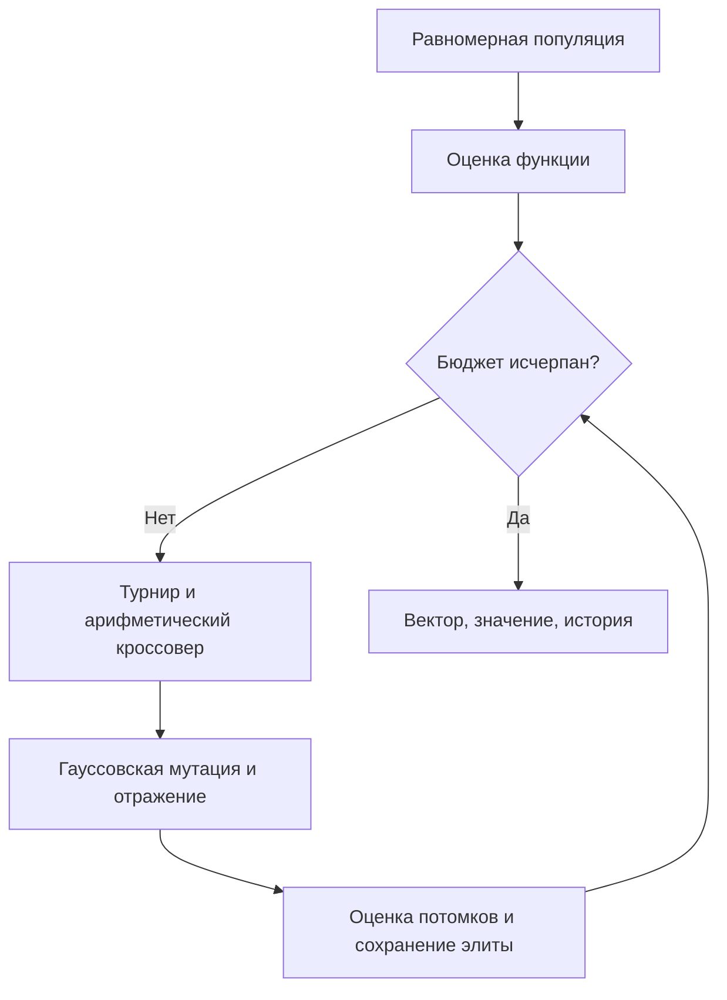

# Лабораторная работа № 1

## Непрерывная оптимизация · Bent Cigar

**Дисциплина:** «Эволюционное программирование и генетические алгоритмы»  
**Группа:** 507 · **номер студента:** 17 · **год:** 2026  
**Вариант:** `V = 1 + ((17 × 17 + 7 × 0 + 26) mod 20) = 16`.

## 1. Постановка и представление

Минимизируется функция «изогнутая сигара» (Bent Cigar):

$$f(x)=x_1^2+10^6\sum_{i=2}^{9}x_i^2,\quad x_i\in[-100,100].$$

Размерность: $d=5+(16\bmod6)=9$. Генотип и фенотип совпадают: вектор девяти вещественных координат. Глобальный минимум строго равен 0 при нулевом векторе, поскольку все слагаемые неотрицательны. Нулевое решение **не внедряется** в начальную популяцию.

Функция гладкая, выпуклая и унимодальная: говорить о многочисленных локальных минимумах здесь неверно. Сложность именно в числе обусловленности $10^6$: первые и остальные координаты влияют на качество в резко различающихся масштабах. Специализированный градиентный метод с нормированием координат был бы естественной альтернативой. Эта работа исследует поведение ГА, а не доказывает его необходимость для данной квадратичной функции.

## 2. Алгоритм

Равномерная инициализация в кубе; турнир из 3 участников; арифметический кроссовер с отдельным равномерным коэффициентом для каждой координаты; независимая гауссовская мутация; отражение вышедших за границы координат; поколенческая замена с сохранением одной лучшей особи. Кроссовер выполняется с вероятностью 0.9, мутация каждой координаты — с вероятностью 1/9.

Масштаб мутации заранее уменьшается геометрически: $\sigma_t=s\cdot15\,(10^{-4}/15)^{t/(G-1)}$. Это **детерминированное расписание**, а не адаптация по успеху. Сравниваются только множители $s=1$ и $s=3$; остальные параметры одинаковы. Выпуклый кроссовер комбинирует координаты без потери вещественного представления. Отражение не создаёт искусственного скопления на границах. Дополнительное задание выполнено реализацией арифметического кроссовера.



## 3. Эксперимент

96 особей, 220 поколений, **21 216 оценок на запуск** (96 начальных + 220 × 96). Три метода × 20 независимых seed 17000–17019 = 60 запусков. Общие seed служат блоками сравнения; внутри каждого метода запуски независимы. Случайный поиск генерирует ровно столько же независимых равномерных векторов. История содержит начальную точку и 220 поколений; для random поколение означает очередной пакет из 96 оценок. Переоценка элиты не выполняется.


## 4. Интерпретация

График логарифмический (symlog с линейной областью около нуля). Показаны среднее, минимум и максимум **лучшего найденного значения**, а не средний фитнес текущей популяции. Итоговые векторы каждого запуска доступны в `results/solutions.json`.

ГА существенно эффективнее случайного поиска на данном бюджете, но остаточная ошибка не позволяет заявлять, что каждый запуск решил задачу с высокой абсолютной точностью. Узкие координаты быстро приближаются к нулю, а прогресс вдоль первой координаты может замедляться после уменьшения масштаба мутации. Более крупный масштаб не гарантирует улучшения и увеличивает разброс. Покоординатные масштабы, нормирование и дополнительные рестарты — направления дальнейшего исследования; в проведённые эксперименты они не подмешаны.

## Численные результаты выполненной серии


Минимум и максимум — значения метрики, направление оптимизации см. в отчёте. Стандартное отклонение выборочное (ddof=1). Полоса на графике — min–max, не доверительный интервал.

| Метод | Запусков | Минимум | Среднее | Медиана | Std | Максимум | Время, с |
|---|---:|---:|---:|---:|---:|---:|---:|
| GA sigma x1 | 20 | 0.0142585 | 318.182 | 207.332 | 313.688 | 974.438 | 0.0169 |
| GA sigma x3 | 20 | 0.685671 | 588.339 | 281.28 | 778.82 | 3207.55 | 0.0165 |
| Random | 20 | 3.82242e+08 | 2.05088e+09 | 2.07124e+09 | 7.16462e+08 | 3.08602e+09 | 0.0030 |

## Полная конфигурация

```json
{
  "population": 96,
  "generations": 220,
  "runs": 20,
  "first_seed": 17000,
  "dimension": 9,
  "crossover_probability": 0.9,
  "mutation_probability": 0.1111111111111111,
  "sigma_start": 15.0,
  "sigma_end": 0.0001,
  "tournament": 3,
  "group": 507,
  "student_number": 17,
  "year": 2026,
  "variant": 16
}
```
